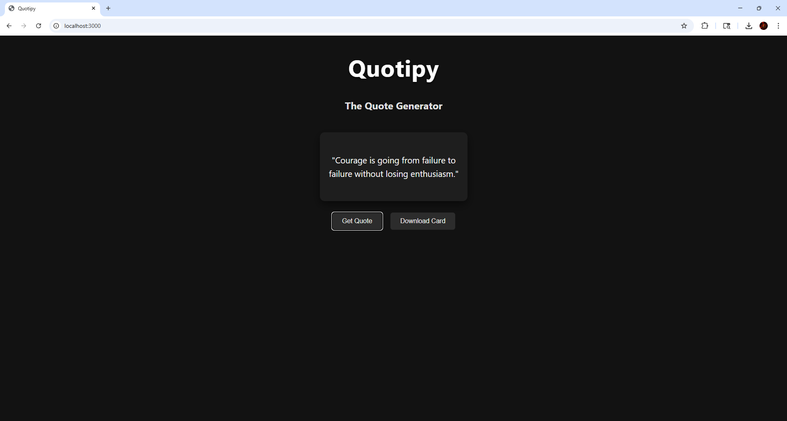

# Quotipy - The Quote Generator 

**Quotipy** is a minimal quote generator web app that lets users fetch random inspirational quotes and download them as stylish quote cards. Built with **Node.js**, **Express**, and a simple **REST API**.


## ✨ Features

-  Generate a random quote using a REST API (`/api/quote`).
-  Display the quote inside a clean, responsive card.
-  Download the quote card as an image (PNG).


## 🔧 Tech Stack

- **Backend:** Node.js, Express (REST API)
- **Frontend:** HTML, CSS, JavaScript


## 📡 API Reference

### `GET /api/quote`

Returns a random quote from a local JSON file:

```json
{
  "quote": "Your time is limited, so don’t waste it living someone else’s life."
}
```


## 📁 Project Structure

```
quotipy/
│
├── public/               # Frontend assets
│   ├── index.html        # Main HTML file
│   ├── main.js           # JS for fetching and rendering quotes
│   ├── style.css         # Styling
│
├── getQuote.js           # Handles quote selection logic
├── quotes.json           # Local quote data source
├── index.js              # Express server setup
├── package.json          # Project dependencies and scripts
```


## 🚀 How to Run Locally

1. **Clone the repository**
```bash
git clone https://github.com/your-username/quotipy.git
cd quotipy
```

2. **Install dependencies**
```bash
npm install
```

3. **Start the server**
```bash
node index.js
```

4. **Visit in your browser**
```
http://localhost:3000
```


## 🖼️ Preview




## 🎓 Workshop Credit

This project was created during a web development workshop organized by the **AIDL Club** at **FCRIT, Mumbai**.  
Special thanks to the mentors and organizers for their guidance and support!
